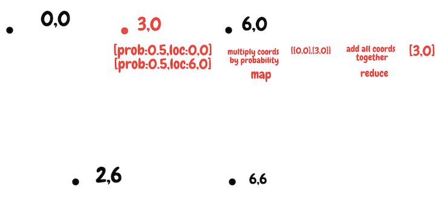

# React Native Room Finder

## Background

A room finder application which will guide the user from their current location to a target location similar to how a sat nav works. 

Rooms are mapped using the machine learning service find3 indoor positioning.

https://www.internalpositioning.com/

A dijkstra's algorithmn is used in order to calculate the shortest given path from a users current location to the target location.

https://en.wikipedia.org/wiki/Dijkstra's_algorithm

### Linear Interpolation

To avoid having to train for every block of a 10x10 floor.
Which would equate to 100 training cycles per floor.
Linear interpolation allows a fraction of the blocks on each floor to be trained on.
Whilst providing full predictive coverage of the floor.

The math behind this is simple, take the probability of each prediction.
And combine these into a final triangulated position value.

***Black**=training data*

***Red**=actual user location*



## TODOs

- Arrow which way to go on stairs (up/down)
- new png images for the floor maps

## Dev setup

### Install

#### Gen keystore
```
cd android/app
keytool -genkey -v -keystore debug.keystore -storepass android -alias androiddebugkey -keypass android -keyalg RSA -keysize 2048 -validity 10000
```

#### Install node modules
```
npm install
```

### Run dev

```
npm run android
```

### Install onto device

```
cd android && \
./gradlew installRelease
```

## Running Find3 Server Locally

```
docker run -p 1884:1883 -p 8005:8003 schollz/find3
```

## Google Cloud Platform

- Create a Kubernetes Engine
- Connect to the cluster
- Deploy the docker container `kubectl create deployment find3 --image=schollz/find3`
- Expose the docker container `kubectl expose deployment find3 --type=LoadBalancer --port=8003`
- Get the external ip `kubectl get services`
- Test the external ip `curl <external-ip>:8003`

##### Extra

- Delete training data `kubectl rollout restart deployment find3`
